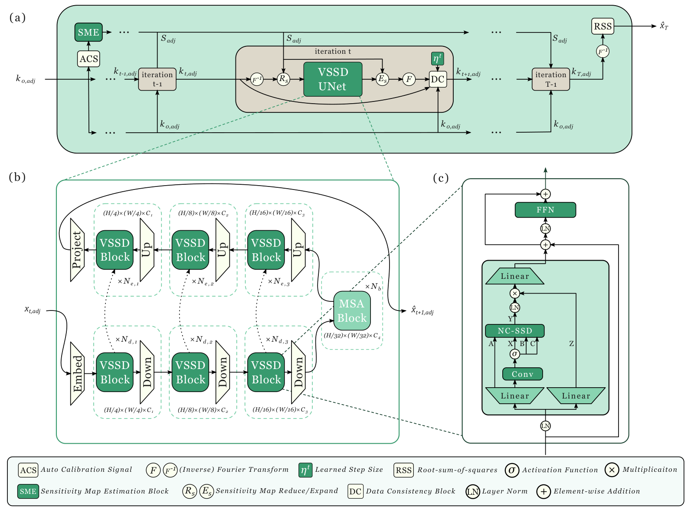

# VSSD-Recon

**Visual State Space Duality for accelerated cardiac MRI reconstruction.**

An end-to-end unrolled network for multi-coil MRI reconstruction. Cascades of
*(data consistency → learned denoiser)* are trained end-to-end in the
[E2E-VarNet](https://arxiv.org/abs/2004.06688) style, with the denoiser built from
Visual State-Space Dual (VSSD) blocks.

The block mixes tokens with a **non-causal SSD (NC-SSD)** operator: a single parallel
pass in which every spatial position reads from one shared global hidden state. Because
that state is the same for all tokens, the result no longer depends on scan order, and
the whole update collapses to `Y = C (Bᵀ (X ⊙ m))` — a form of linear attention over the
flattened feature map. The receptive field is global and direction-free at linear cost,
avoiding both the quadratic cost of self-attention and the cross-shaped attenuation of
multi-scan SSMs such as VMamba. In code: `Mamba2.non_casual_linear_attn` in
[models/VSSDBlock.py](models/VSSDBlock.py).

<p align="center">
  
</p>

<p align="center">
  <sub>
  <b>(a)</b> the unrolled cascade: sensitivity maps are estimated once from the ACS region,
  then each iteration applies the VSSD U-Net in image space and a data-consistency step in
  k-space, with a learned step size <code>&eta;<sup>t</sup></code>.
  <b>(b)</b> the VSSD U-Net: patch embed to H/4, three down stages, an MSA bottleneck at
  H/32, three up stages with skips.
  <b>(c)</b> the VSSD block: NC-SSD token mixer with a depthwise conv producing X/B/C, a
  gate Z, and an FFN. Source: <a href="assets/architecture.pdf">architecture.pdf</a>.
  </sub>
</p>

Built for the [CMRxRecon2025](https://cmrxrecon.github.io/) challenge (multi-centre and
multi-disease generalisation tasks), on top of
[PromptMR+](https://github.com/hellopipu/PromptMR-plus). Method reference: Shi et al.,
[VSSD: Vision Mamba with Non-Causal State Space Duality](https://arxiv.org/abs/2407.18559).


## Repository layout

```text
main.py                  LightningCLI entry point (fit / validate / predict)
models/                  Model variants — see models/README.md for the matrix
  VSSDBlock.py           the VSSD block and its NC-SSD mixer (Mamba2 parameterisation)
  vssd_recon*.py         VSSD U-Net cascades; swin_recon / vss_recon / e2e_recon baselines
data/                    Datasets, transforms, mask functions (from PromptMR+)
mri_utils/               FFT, coil combination, SSIM loss, metrics, I/O
pl_modules/              LightningModule + DataModule wrappers
configs/                 Composable YAML: base + model + train|inference
scripts/                 Data prep and Slurm jobs
test/                    Self-contained CMRxRecon2025 Docker submission package
support/                 Vendored CMRxRecon2025 organiser MATLAB code (unmodified)
docs/                    Dataset prep, upstream README
```

## Model variants

`model_version` in the model config selects the module under `models/`:
`vssd_recon` (the VSSD U-Net as trained for the challenge), `vssd_recon_fixed` (the same
with three scaffold defects corrected — head normalisation, an inert `patch_size`, the
sign of `dA`), `vssd_recon_convsme` (conv sensitivity model), and the `e2e_recon`,
`swin_recon`, `vss_recon` baselines. The matrix, and the defects, are in
[models/README.md](models/README.md).

| config | model |
| --- | --- |
| `configs/model/vssd-recon.yaml` | `vssd_recon`, the "Tiny" preset |
| `configs/model/vssd-recon-fixed.yaml` | `vssd_recon_fixed`, same sizes |
| `configs/model/pmr.yaml`, `pmr-plus.yaml`, `pmamba.yaml` | PromptMR / PromptMR+ / PromptMamba baselines |

## Installation

Requires a CUDA GPU. Install a `torch` build matching your CUDA toolkit first, then:

```bash
pip install torch==2.5.1 --index-url https://download.pytorch.org/whl/cu124
pip install -r requirements.txt
```

`mamba-ssm` is only needed for the causal-SSD path (`linear_attn_duality=False`) and the
`vss_recon` baseline; the import is optional, so the NC-SSD path runs without it.

`configs/env_local.txt` and `configs/env_pypi.txt` are the Compute Canada wheel lists
used on the cluster (`+computecanada` local versions, installable only there with
`pip --no-index`). Use `requirements.txt` anywhere else.

## Data

See [docs/DATASET.md](docs/DATASET.md). In short: convert the challenge MATLAB volumes
to per-volume HDF5, split with a JSON manifest from `configs/data_split/`, and — for the
2025 pseudo-radial masks — build a mask bank once.

## Train

Configs compose left to right: **base → model → dataset**.

```bash
python main.py fit \
    --config configs/base.yaml \
    --config configs/model/vssd-recon.yaml \
    --config configs/train/vssd-recon/cmr25-cardiac.yaml
```

On a Slurm cluster, `scripts/submit_batch_train.sh` wraps the same command.

Training minimises SSIM loss with AdamW (`lr 2e-4`, weight decay `1e-2`), batch size 1
per GPU. Each sample is under-sampled with a randomly chosen mask — Cartesian uniform,
variable-density Gaussian, or radial — at acceleration ×8, ×16 or ×24, keeping the
central 20 k-space lines (central 20×20 region for radial) fully sampled. Set
`use_checkpoint: true` and `compute_sens_per_coil: true` to trade compute for GPU memory.

**Data paths in the shipped configs are absolute** and point at the original cluster
scratch (`/home/nicocarp/scratch/VSSD-Recon/...`). Edit `data.init_args.data_path`,
`mask_func.init_args.mask_path`, `trainer.logger.init_args.save_dir` and `ckpt_path`
before running elsewhere.

## Inference

```bash
python main.py predict --config configs/inference/vssd-recon/cmr25-cardiac.yaml
```

The model is rebuilt from the checkpoint's saved hyperparameters, so the model config
is not needed at predict time. `CustomWriter` in [main.py](main.py) gathers predictions
across ranks, reassembles volumes by filename and slice index, and writes them under
`<output_dir>/reconstructions`.

For the challenge submission format, `scripts/submit_batch_postproc.sh` runs the
organisers' MATLAB `mainRun4Ranking_2025.m` from `support/`, and
`scripts/submit_batch_compress.sh` zips the result. The container that was submitted is
in [test/](test/README.md).

## Acknowledgements

Built on [PromptMR+](https://github.com/hellopipu/PromptMR-plus) (Xin et al., ECCV 2024)
— its data pipeline, Lightning modules and config layout are inherited largely
unchanged. Block designs draw on [VSSD](https://github.com/YuHengsss/VSSD),
[Mamba2](https://github.com/state-spaces/mamba) and
[VMamba](https://github.com/MzeroMiko/VMamba). `support/` holds the CMRxRecon2025
organisers' demo code, unmodified.

## License

Non-commercial research use, inherited from PromptMR+ — see [LICENSE.md](LICENSE.md).
